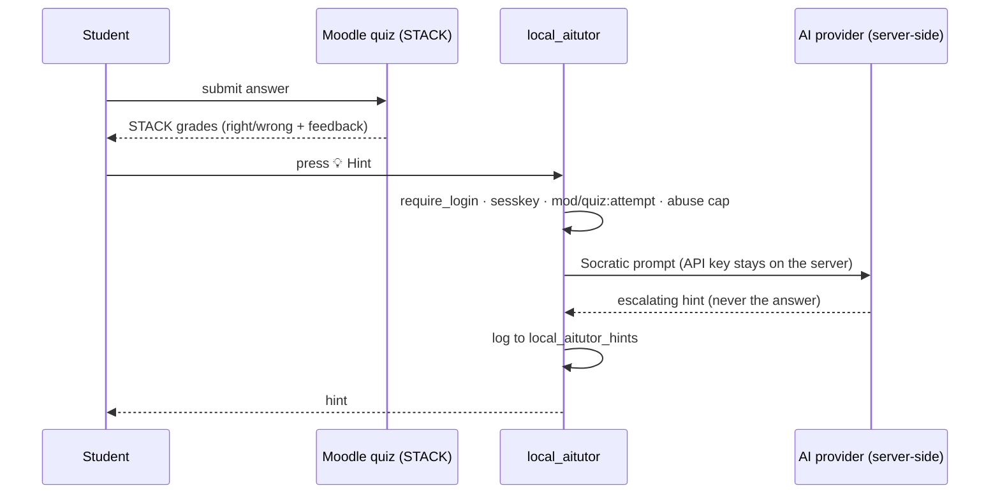

# AI Tutor (local_aitutor)

A Moodle **local plugin** that adds a patient **Socratic AI tutor** to
[STACK](https://stack-assessment.org/) quiz-attempt pages. When a student is stuck, they press
**💡 Hint** and get a short, escalating nudge about *their* specific mistake — **never** the final
answer. The AI provider's API key lives **server-side**; the browser only ever calls this plugin's
own endpoint.

It can also show an optional **🧭 Practise next** banner: a suggestion of what to work on next,
produced by an external reinforcement-learning teaching policy from the student's measured per-skill
mastery.

## Requirements

- **Moodle 4.5 LTS** or later (developed and tested on 4.5; uses the Hooks API).
- The **STACK question type** (`qtype_stack`) — the tutor targets STACK questions and declares
  `qtype_stack` as a dependency.
- An API key for one external **AI provider** (OpenAI, Anthropic Claude, Google Gemini, Groq,
  DeepSeek, Mistral, Cerebras, or an OpenAI-compatible gateway).
- *(Optional)* a **/recommend** teaching-policy service for the "Practise next" banner — a reference
  implementation ships with the parent project,
  [stack-question-forge](https://github.com/danielcregg/stack-question-forge).

## Install

### From the Moodle Plugins directory (recommended once published)
Site administration → Plugins → Install plugins → search for *AI Tutor*.

### Manually
Copy this directory to `<moodleroot>/local/aitutor` (the folder **must** be named `aitutor`), then
visit *Site administration → Notifications*, or run `php admin/cli/upgrade.php --non-interactive`.

## Configure

*Site administration → Plugins → Local plugins → AI Tutor*. The plugin is **disabled by default**
and does nothing until you:

| Setting | Description |
|---|---|
| **Enable the AI tutor** | Master switch. Off by default. |
| **AI provider** | Which external service generates hints. |
| **Model** | The model id, e.g. `gpt-4o-mini`, `gemini-2.5-flash`, `claude-3-5-haiku`. |
| **AI API key** | Stored server-side, never sent to the browser. |
| **Max hints per question** | Escalation cap per question (a separate hard server cap prevents abuse). |
| **RL teaching-policy URL** *(optional)* | `/recommend` endpoint for the "Practise next" banner. Empty = feature off. |
| **RL service token** *(optional)* | Bearer token, only if the policy URL is a public route. |

## How it works

- A footer hook loads the `local_aitutor/tutor` AMD module **only** on STACK quiz-attempt pages.
- The module adds a hint button to each STACK question, reads the student's current answer + grader
  feedback from the DOM, and posts them to `ajax.php`.
- `ajax.php` re-checks `mod/quiz:attempt`, enforces an abuse cap, calls the AI **server-side**, logs
  the hint, and returns it. The Socratic system prompt forbids revealing the answer.

### CAS-grounded hints (the oracle, not the LLM, does the maths)

LLMs are unreliable at symbolic maths, so the tutor never asks the AI to judge correctness. Instead,
for a STACK question it asks **Moodle's own STACK / Maxima** to classify how the student's current
answer relates to a correct one, and gives the AI only that qualitative class:

- **equivalent** — algebraically correct but in the wrong *form* (e.g. not expanded/factored);
- **constant** — off by a constant term;
- **structural** — a term involving the variable is wrong, missing or extra.

Only the class is sent to the AI. The model answer and the exact difference are computed server-side
and never leave it, so the hint stays accurate **and** cannot leak the answer. If grounding is not
available (non-STACK or multi-input question, an invalid answer, or any CAS error) the tutor falls
back to hinting from the question text and grader feedback alone. The student value enters the CAS only
through STACK's own validated-input path, and the question usage is verified to belong to the student's
own attempt first.

## Privacy

This plugin **stores** a per-user hint log (`local_aitutor_hints`) and **discloses** the question
text, the student's answer, the grader feedback, and (for STACK questions) a short qualitative
diagnosis of the answer to the configured external AI provider in order to generate a hint. The model
answer and exact CAS values are never sent. All of this is declared via the Moodle Privacy API
(`classes/privacy/`), including full export and deletion support. Choose a provider whose data-handling
terms suit your institution.

## Security

- Disabled by default; no external call until fully configured.
- Server-side key only; capability-gated (`mod/quiz:attempt`) with sesskey; per-user/per-quiz hint cap.
- The optional recommendation URL is admin-only and validated (http/https, host required, no embedded
  credentials), redirects disabled, protocols pinned; its response is allow-listed before display.

## For reviewers / maintainers

- To exercise hints, set a provider + model + key and attempt a STACK quiz. The "Practise next"
  banner is optional and only appears when a `/recommend` URL is configured.
- The committed `amd/build/tutor.min.js` is a working build of `amd/src/tutor.js`. Regenerate it
  canonically with `grunt amd` from a Moodle checkout before tagging a release.

## License

[GNU GPL v3 or later](LICENSE) — the same license as Moodle.
